# 🗄️ Backup Monitoring System (BMS)

<div align="center">

**A centralized web-based platform for monitoring, scheduling, and managing backups of remote database servers running across different IP addresses within an organization's network.**


</div>

---

# Overview

Backup Monitoring System (BMS) is a full-stack web application developed during my internship at **East Coast Railway** to centralize the monitoring and backup management of database servers running across different IP addresses within an organization's network.

The application enables administrators to register remote database instances using their IP address and port number, verify server reachability through a TCP socket connection, schedule backups, execute immediate backups, browse backup storage locations, and monitor backup history from a single dashboard.

Before an instance is registered, the system performs a TCP connection test by attempting to establish a socket connection with the target server. A successful TCP socket connection confirms that the target server is reachable over the network before it is registered for backup operations.

The backend executes native database backup utilities (`mysqldump`, `exp`, and `pg_dump`) against the configured remote servers while maintaining complete backup history, scheduling information, execution logs, and reporting data within MySQL.

---

## Features

- Centralized monitoring of database servers running across different IP addresses
- Support for MySQL, Oracle, and PostgreSQL database instances
- Register remote servers using IP address and port number
- TCP socket-based connectivity verification before registering an instance
- Manual and scheduled database backups
- Automatic backup execution using native database utilities
- Browse system folders to choose backup storage locations
- Real-time backup progress with toast notifications
- Backup history with downloadable backup files
- Reports dashboard with charts and analytics
- CSV export of backup reports
- Secure session-based authentication using bcrypt and express-session
- Automatic TCP connectivity refresh every 10 seconds
- Automatic restoration of pending scheduled backups after server restart using `reloadScheduledJobs()`

---

# Screenshots

| Login | Dashboard |
|---|---|
| 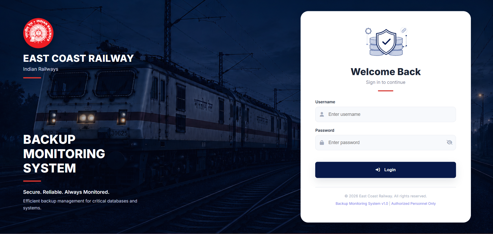 | 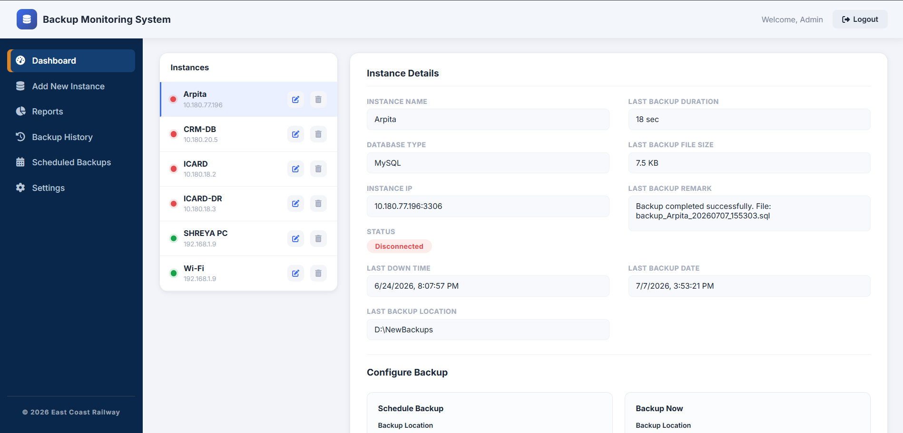 |

| Add New Instance | Check Connection |
|---|---|
| 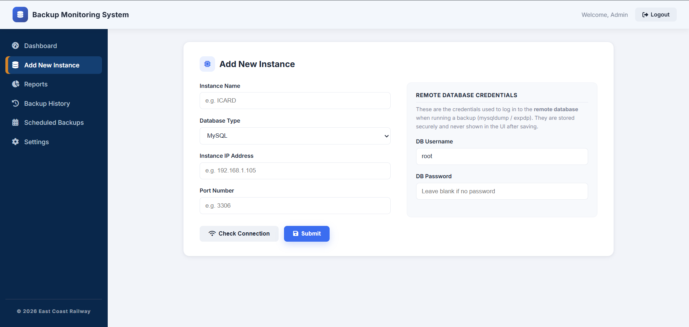 | 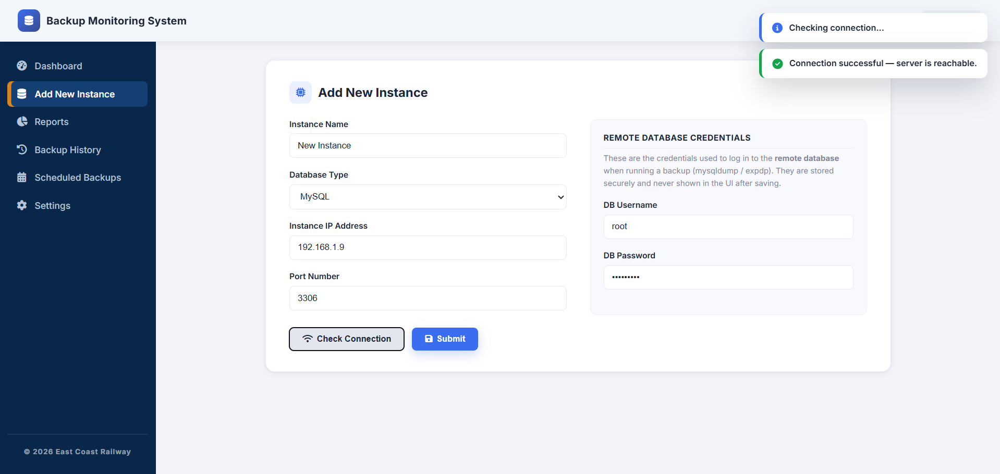 |

| Configure Backup | Browse Folder |
|---|---|
| 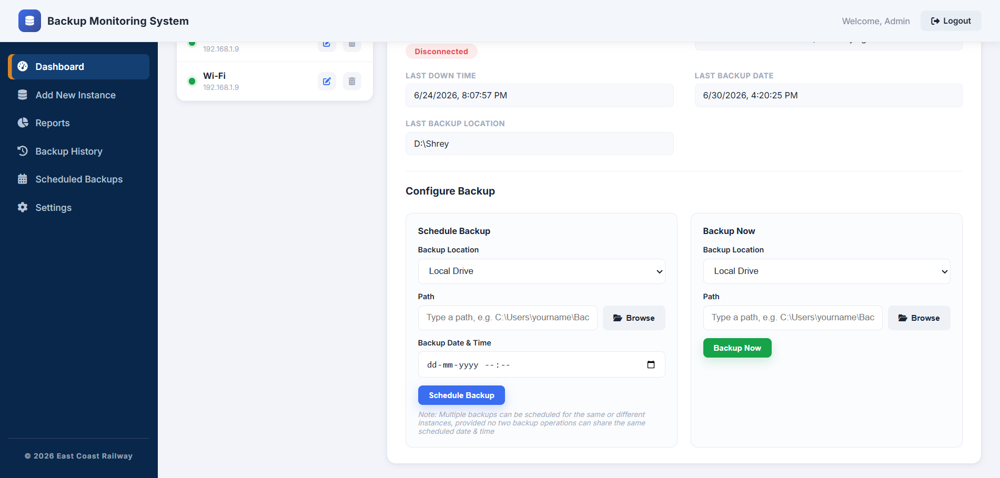 | 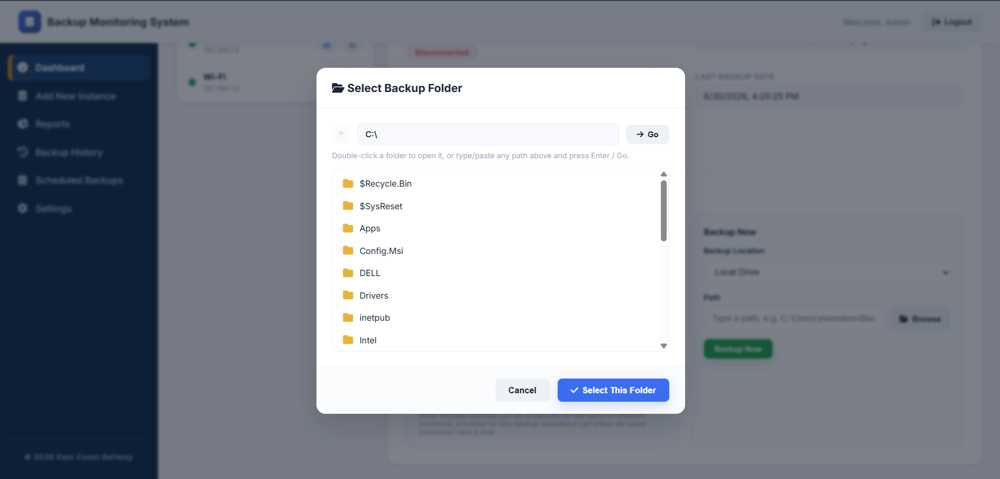 |

| Backup Progress & Notifications | Backup History |
|---|---|
| 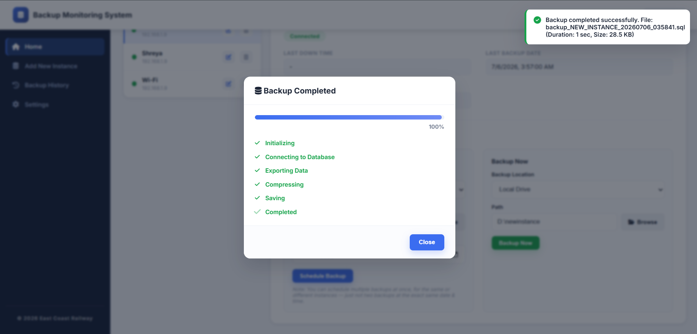 | 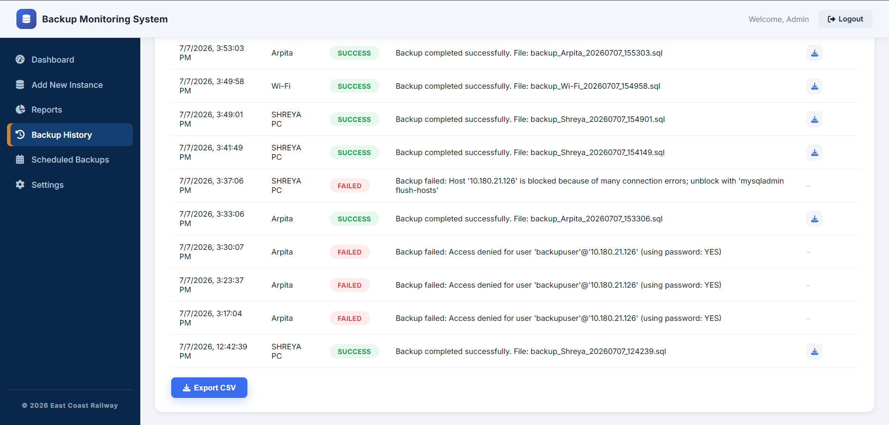 |

| Reports | Scheduled Backups |
|---|---|
| 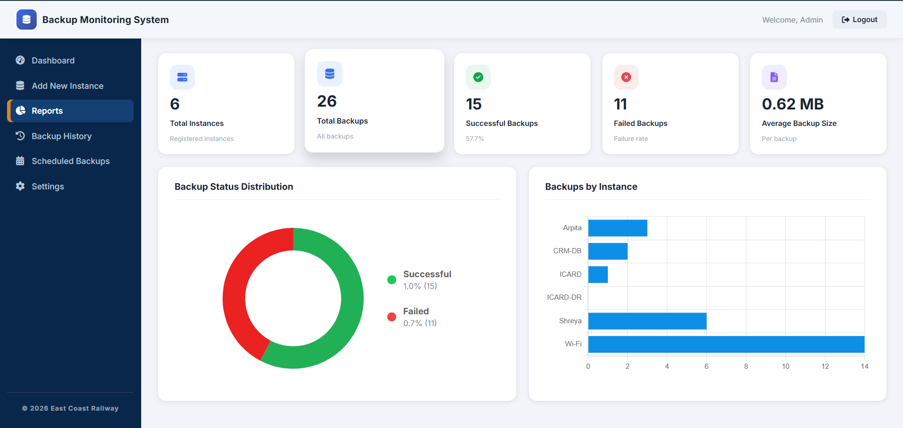 | 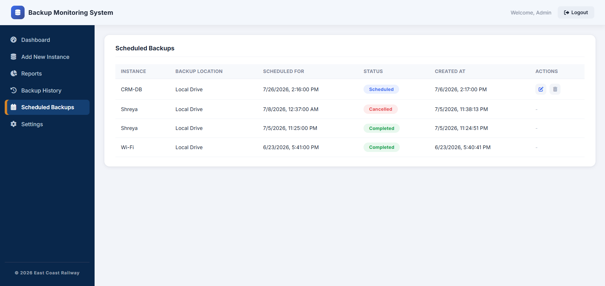 |

| Edit Scheduled Backup | Settings |
|---|---|
| 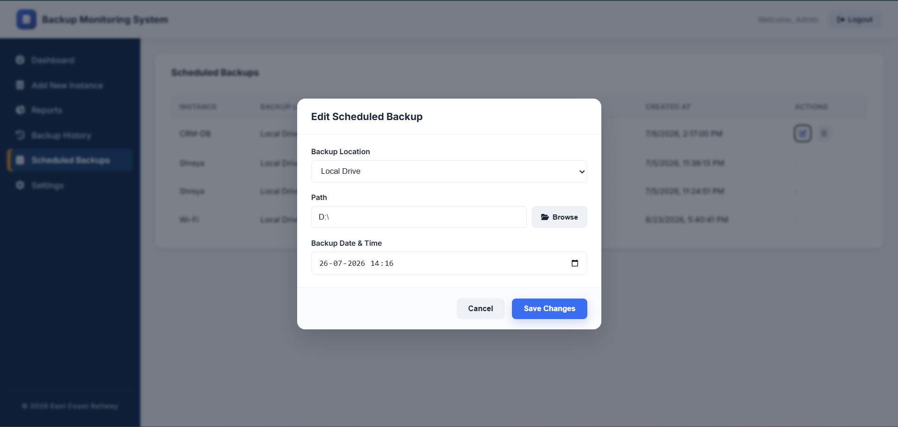 | 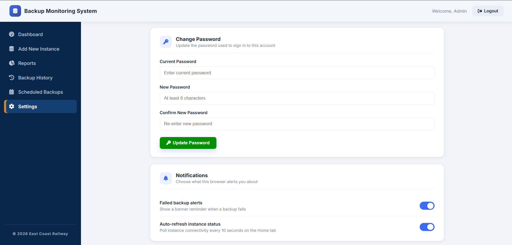 |

---

# Tech Stack

| Layer | Technology |
|---|---|
| Frontend | HTML, CSS, Vanilla JavaScript |
| Backend | Node.js, Express.js |
| Database | MySQL 8.0 (`mysql2/promise`) |
| Authentication | express-session + bcrypt |
| Backup Engine | mysqldump, Oracle exp, PostgreSQL pg_dump |
| Charts | Chart.js |
| Networking | Node.js `net` module (TCP socket connectivity) |
| File System | Node.js `fs` module |
| Child Processes | Node.js `child_process.spawn` |

---

# Folder Structure

```text
Backup-Monitoring-System/
│
├── backend/
│   ├── db/
│   │   └── pool.js
│   ├── middleware/
│   │   └── auth.js
│   ├── routes/
│   │   ├── auth.js
│   │   ├── backup.js
│   │   ├── filesystem.js
│   │   └── instances.js
│   ├── scripts/
│   │   ├── hashPassword.js
│   │   └── seedAdmin.js
│   ├── .env.example
│   ├── package.json
│   └── server.js
│
├── frontend/
│   ├── css/
│   ├── images/
│   ├── js/
│   │   ├── app.js
│   │   ├── login.js
│   │   ├── home.js
│   │   ├── addInstance.js
│   │   ├── reports.js
│   │   └── settings.js
│   ├── login.html
│   ├── home.html
│   ├── addInstance.html
│   ├── reports.html
│   ├── backupHistory.html
│   ├── scheduledBackups.html
│   └── settings.html
│
├── sql/
│   └── schema.sql
│
├── docs/
│   ├── REMOTE_MYSQL_SETUP.md
│   └── screenshots/
│
├── .gitignore
└── README.md
```

---

# High-Level System Flow

```mermaid
flowchart TD

    A[Administrator Login] --> B[Dashboard]

    B --> C[Register Database Instance]
    C --> D[Enter Server IP Address & Port]
    D --> E[TCP Socket Connection Test]

    E -->|Reachable| F[Save Database Instance]
    E -->|Connection Failed| D

    B --> G[Configure Backup]
    G --> H[Browse Backup Folder]

    B --> I[Backup Now]
    B --> J[Schedule Backup]

    I --> K[Backup Engine]
    J --> K

    K --> L{Database Type}

    L --> M[MySQL<br/>mysqldump]
    L --> N[Oracle<br/>exp]
    L --> O[PostgreSQL<br/>pg_dump]

    M --> P[(Remote Database Servers)]
    N --> P
    O --> P

    P --> Q[(Backup Files)]

    Q --> R[(backup_history)]

    R --> S[Reports]
    R --> T[Backup History]
    R --> U[Scheduled Backups]

    U --> V[Edit / Cancel Schedule]

    J -.-> W[setTimeout()]
    W -.-> X[reloadScheduledJobs()<br/>on Server Restart]
    X -.-> J
```

---

# Getting Started

## 1. Database Setup

```bash
mysql -u root -p < sql/schema.sql
```

## 2. Backend Setup

```bash
cd backend
npm install
cp .env.example .env
```

Configure `.env`:

```env
PORT=3000
DB_HOST=localhost
DB_PORT=3306
DB_USER=root
DB_PASSWORD=your_password
DB_NAME=backup_db
SESSION_SECRET=your_secret_key
```

## 3. Create Default Administrator

```bash
node scripts/seedAdmin.js
```

Default credentials:

```text
Username : admin
Password : admin123
```

## 4. Run the Application

```bash
npm start
```

Open:

```text
http://localhost:3000
```

---

# Application Pages

| Page | Description |
|---|---|
| Login | Administrator authentication |
| Dashboard | Monitor instances and initiate backups |
| Add New Instance | Register database servers and validate connectivity |
| Reports | Backup analytics and charts |
| Backup History | View and download completed backups |
| Scheduled Backups | Create, edit and manage backup schedules |
| Settings | Password and application preferences |

---

# API Overview

| Method | Endpoint | Description |
|---|---|---|
| POST | `/api/login` | Login |
| GET | `/api/session` | Session status |
| GET | `/api/logout` | Logout |
| GET | `/api/instances` | List instances |
| POST | `/api/instances` | Register instance |
| PUT | `/api/instances/:id` | Update instance |
| DELETE | `/api/instances/:id` | Delete instance |
| GET | `/api/instances/check-connection` | Validate TCP connection |
| POST | `/api/backup/now` | Execute backup |
| POST | `/api/backup/schedule` | Schedule backup |
| PUT | `/api/backup/schedule/:id` | Edit schedule |
| DELETE | `/api/backup/schedule/:id` | Cancel schedule |
| GET | `/api/backup/reports` | Reports |
| GET | `/api/backup/export` | Export CSV |
| GET | `/api/backup/download/:historyId` | Download backup |
| GET | `/api/filesystem/list` | Browse folders |

---

# Backup Engine

Each registered database instance maintains its IP address, port number, database type, authentication credentials, backup destination, and scheduling configuration required for remote backup execution.

Whenever a backup is initiated—either manually or through a scheduled job—the application:

1. Retrieves the target database instance from MySQL.
2. Verifies server reachability by attempting to establish a TCP socket connection.
3. Selects the appropriate native backup utility based on the configured database type.
4. Executes the backup utility against the remote database server.
5. Stores the generated backup file in the selected backup directory.
6. Logs the backup status, execution time, duration, file size, and remarks in the `backup_history` table.

Supported backup utilities:

- **MySQL** → `mysqldump`
- **Oracle** → `exp`
- **PostgreSQL** → `pg_dump`

## Scheduled Backup Mechanism

Instead of using **node-cron**, the application schedules one-time backup jobs using JavaScript's `setTimeout()`.

Since JavaScript timers exist only in process memory, all active `setTimeout()` timers are lost whenever the Node.js server restarts. During application startup, the `reloadScheduledJobs()` function reloads every pending backup schedule from the database, recalculates the remaining execution time, and recreates the corresponding timers.

On every server restart:

- Pending backup schedules are loaded from the database.
- Remaining execution time is recalculated.
- New `setTimeout()` timers are created automatically.
- Previously scheduled backups continue to execute without requiring users to recreate them.

This approach keeps scheduling lightweight while ensuring scheduled backups are not lost after application restarts.

---

# Security

- Passwords are hashed using bcrypt.
- Session-based authentication using express-session.
- Parameterized SQL queries prevent SQL injection.
- Protected API routes require authentication.
- Backup downloads are validated before being served.
- Sensitive configuration is stored in `.env`.
- TCP connectivity can be verified before adding new database instances.

# Reliability

- TCP socket connectivity is verified before registering remote database instances.
- Pending scheduled backups are automatically restored after application restart using `reloadScheduledJobs()`.
- One-time backup schedules persist across server restarts without relying on `node-cron`.
- Backup execution history is stored in MySQL for auditing and reporting.
- Native database backup utilities are executed through controlled child processes.

---

<div align="center">

Developed during my Software Development Internship at **East Coast Railway**

**Backup Monitoring System • Version 1.0**

</div>