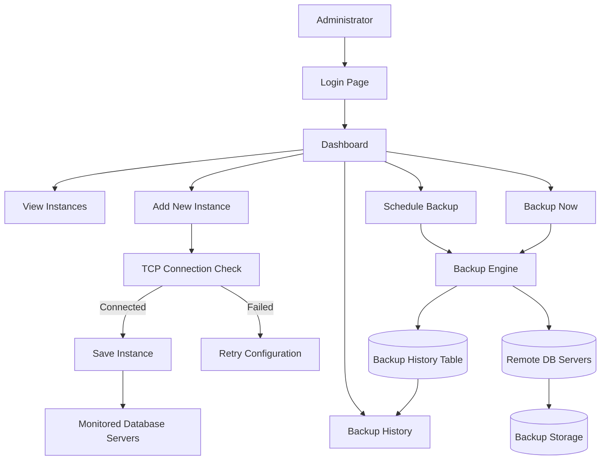

# Backup Monitoring System

A web-based application to monitor database server instances running across different IP addresses and manage their backups. The system provides real-time connectivity checks, backup scheduling, manual backup execution, backup history tracking, and secure session-based authentication through a responsive web interface.

---

## Features

* Secure login with session-based authentication
* Responsive dashboard for desktop, tablet, and mobile devices
* Real-time database server monitoring
* TCP-based connectivity validation
* Add and manage database instances
* Schedule automated backups
* Trigger immediate backups
* Backup history tracking
* Password visibility toggle on login page
* Mobile-friendly navigation with hamburger menu
* Session validation on protected pages
* Backup status and health monitoring

---

## Tech Stack

### Frontend

* HTML5
* CSS3
* Vanilla JavaScript
* Fetch API (AJAX)

### Backend

* Node.js
* Express.js

### Database

* MySQL 8.0
* mysql2

### Authentication

* express-session
* bcrypt

---

# Folder Structure

```text
BackupMonitoringSystem/
│
├── sql/
│   └── schema.sql
│
├── backend/
│   ├── server.js
│   ├── package.json
│   ├── .env.example
│   │
│   ├── db/
│   │   └── pool.js
│   │
│   ├── middleware/
│   │   └── auth.js
│   │
│   ├── routes/
│   │   ├── auth.js
│   │   ├── instances.js
│   │   └── backup.js
│   │
│   └── scripts/
│       ├── hashPassword.js
│       └── seedAdmin.js
│
└── frontend/
    ├── css/
    │   └── style.css
    │
    ├── js/
    │   ├── app.js
    │   ├── login.js
    │   ├── home.js
    │   ├── addInstance.js
    │   ├── backupHistory.js
    │   └── reports.js
    │
    ├── login.html
    ├── home.html
    ├── addInstance.html
    ├── backupHistory.html
    └── reports.html
```

---

## High Level System Flow


---

# Database Setup

### 1. Create the Database

Run the schema file:

```bash
mysql -u root -p < sql/schema.sql
```

This creates the database:

```text
backup_monitor_db
```

and the following tables:

* users
* instances
* backup_schedules
* backup_history

---

### 2. Default Admin User

The admin user is created separately using a script because passwords are stored as bcrypt hashes.

---

# Backend Setup

Install dependencies:

```bash
cd backend
npm install
```

Copy environment file:

```bash
cp .env.example .env
```

Update `.env`:

```env
DB_HOST=localhost
DB_PORT=3306
DB_USER=root
DB_PASSWORD=your_mysql_password
DB_NAME=backup_monitor_db

SESSION_SECRET=your_secure_session_secret

PORT=3000
```

---

# Create Admin User

```bash
cd backend
node scripts/seedAdmin.js
```

Default credentials:

```text
Username: admin
Password: admin123
```

You can also create custom credentials:

```bash
node scripts/seedAdmin.js myuser mypassword
```

---

# Run the Application

### Production

```bash
npm start
```

### Development

```bash
npm run dev
```

Open:

```text
http://localhost:3000
```

Login using:

```text
admin / admin123
```

---

# API Reference

| Method | Endpoint                                    | Auth | Description              |
| ------ | ------------------------------------------- | ---- | ------------------------ |
| GET    | `/api/session`                              | No   | Check login status       |
| POST   | `/api/login`                                | No   | User login               |
| GET    | `/api/logout`                               | No   | Logout user              |
| GET    | `/api/instances`                            | Yes  | Fetch all instances      |
| GET    | `/api/instances/:id`                        | Yes  | Fetch instance details   |
| GET    | `/api/instances/check-connection?ip=&port=` | Yes  | Check TCP connectivity   |
| POST   | `/api/instances`                            | Yes  | Add database instance    |
| POST   | `/api/backup/schedule`                      | Yes  | Schedule backup          |
| POST   | `/api/backup/now`                           | Yes  | Trigger immediate backup |

Protected endpoints require an active authenticated session.

---

# Application Flow

## Login Page

### Features

* Session-based authentication
* Secure password verification using bcrypt
* Inline error handling
* Password visibility toggle
* Responsive design

### Flow

1. User enters credentials.
2. Credentials are sent to `/api/login`.
3. Backend validates user.
4. Session is created.
5. User is redirected to Dashboard.
6. Unauthorized users are redirected back to Login.

---

## Dashboard (Home)

The dashboard provides a complete overview of all monitored database instances.

### Instance List

Displays:

* Instance Name
* Instance IP Address
* Connection Status

### Instance Details

Displays:

* Instance Name
* Database Type
* Instance IP and Port
* Current Status
* Last Down Time
* Last Backup Date
* Last Backup Location
* Last Backup Duration
* Last Backup File Size
* Last Backup Remarks

### Configure Backup

#### Schedule Backup

Allows administrators to:

* Select backup location
* Define backup path
* Configure backup date and time

The system ensures only one active backup schedule exists per instance.

#### Backup Now

Allows immediate backup execution.

Upon successful backup:

* Backup history is updated
* Instance metadata is refreshed
* Dashboard values are automatically updated

---

## Add New Instance

Administrators can register new database servers.

### Required Information

* Instance Name
* Database Type
* Instance IP Address
* Port Number

### Optional Information

Remote database credentials:

* Database Username
* Database Password

These credentials are used during backup execution and are never displayed in the UI after being saved.

### Check Connection

The Check Connection feature performs a real TCP socket connection test.

Possible results include:

* Connected
* Disconnected
* Connection Timeout
* Connection Refused

This validates network accessibility before the instance is added.

### Submit

Adds the instance to the monitoring system and stores its configuration in the database.

---

## Backup History

The Backup History page provides a record of all executed backups.

Information displayed includes:

* Backup Date
* Backup Location
* Backup Duration
* Backup File Size
* Backup Status
* Backup Remarks

This helps administrators audit and track backup operations.

---

## Reports

The Reports section is reserved for future reporting and analytics features.

Potential enhancements include:

* Backup success statistics
* Storage utilization reports
* Server availability reports
* Historical trend analysis

---

# Mobile Responsiveness

The application is fully responsive and optimized for mobile devices.

Features include:

* Responsive layouts
* Mobile-friendly forms
* Adaptive dashboard panels
* Hamburger navigation menu
* Compact top bar
* Optimized spacing for small screens

---

# Monitoring Architecture

Each database server is represented as an instance identified by:

```text
Instance IP + Port
```

The monitoring module verifies connectivity by opening a real TCP socket to the target host.

This approach allows monitoring of servers located anywhere on the organization's network, provided they are reachable.

---

# Backup Architecture

The current implementation supports:

* Backup scheduling
* Backup history logging
* Manual backup execution

Backup execution currently uses simulated backup metadata for demonstration purposes.

In production environments, this can be replaced with actual backup tools such as:

### MySQL

```bash
mysqldump
```

### Oracle

```bash
expdp
```

or

```bash
RMAN
```

### PostgreSQL

```bash
pg_dump
```

### SQL Server

```bash
sqlcmd
```

or SQL Server Agent jobs.

---

# Security Notes

* Passwords are hashed using bcrypt.
* Sessions are managed using express-session.
* Protected routes require authentication.
* Database credentials are never exposed through the UI after saving.
* Unauthorized users are redirected to Login.
* Strong SESSION_SECRET values should be used in production.
* HTTPS should be enabled in production environments.
* Login rate limiting is recommended for production deployments.
* Persistent session stores such as Redis or MySQL should replace the default memory store in production.

---

# Future Enhancements

* Email backup notifications
* Cloud storage integration
* Backup restore functionality
* Backup retention policies
* Multi-user support
* Role-based access control
* Advanced monitoring dashboards
* Backup analytics and reporting
* Multi-database enhancements
* Alerting and notification systems