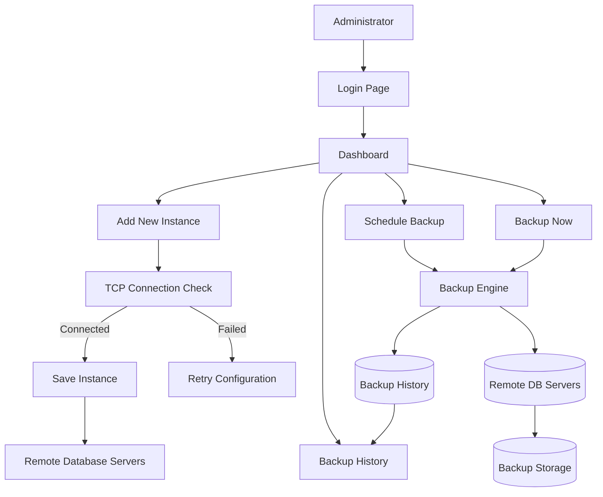

# Backup Monitoring System

A web-based application to monitor database server instances (running on different IP addresses across the company) and manage their backups — view status, validate connectivity, schedule backups, and trigger immediate backups.

**Tech Stack**

* Frontend: HTML, CSS, JavaScript (vanilla, no framework, `fetch`-based AJAX)
* Backend: Node.js + Express.js (REST JSON API)
* Database: MySQL 8.0 (via `mysql2`)
* Auth: express-session + bcrypt password hashing

---

## 1. Folder Structure

```text
BackupMonitoringSystem/
│
├── sql/
│   └── schema.sql                  -- DB schema + seed data
│
├── backend/
│   ├── server.js                   -- Express app entry point
│   ├── package.json
│   ├── .env.example                -- copy to .env and edit
│   │
│   ├── db/
│   │   └── pool.js                 -- MySQL connection pool
│   │
│   ├── middleware/
│   │   └── auth.js                 -- requireAuth session guard
│   │
│   ├── routes/
│   │   ├── auth.js                 -- /api/session, /api/login, /api/logout
│   │   ├── instances.js            -- /api/instances/*
│   │   └── backup.js               -- /api/backup/*
│   │
│   └── scripts/
│       ├── hashPassword.js         -- generate bcrypt hashes
│       └── seedAdmin.js            -- create/update default admin user
│
└── frontend/
    ├── css/
    │   └── style.css
    ├── js/
    │   ├── app.js                  -- shared layout/session validation
    │   ├── login.js
    │   ├── home.js
    │   ├── addInstance.js
    │   ├── backupHistory.js
    │   └── reports.js
    │
    ├── login.html                  -- Login page
    ├── home.html                   -- Dashboard
    ├── addInstance.html            -- Add New Instance
    ├── backupHistory.html          -- Backup History
    └── reports.html                -- Reports
```

---

## 2. High Level System Flow



---

## 3. Database Setup

1. Start MySQL and run the schema script:

   ```bash
   mysql -u root -p < sql/schema.sql
   ```

   This creates the database `backup_monitor_db` with tables:

   * `users` — application login credentials
   * `instances` — monitored database servers
   * `backup_schedules` — scheduled backup jobs
   * `backup_history` — log of backup executions

2. Create the default admin user using the script described below.

---

## 4. Backend Setup

```bash
cd backend
npm install
cp .env.example .env
```

Edit `.env` with your MySQL credentials:

```env
DB_HOST=localhost
DB_PORT=3306
DB_USER=root
DB_PASSWORD=<your_mysql_password>
DB_NAME=backup_monitor_db

SESSION_SECRET=some-long-random-string

PORT=3000
```

---

## 5. Create the Default Admin User

```bash
cd backend
node scripts/seedAdmin.js
```

This creates:

```text
Username: admin
Password: admin123
```

Or create your own:

```bash
node scripts/seedAdmin.js myuser mypassword
```

---

## 6. Run the Application

```bash
cd backend
npm start
```

For development:

```bash
npm run dev
```

Open:

```text
http://localhost:3000
```

Login using:

```text
admin / admin123
```

---

## 7. API Reference

| Method | Endpoint                                    | Auth | Description                 |
| ------ | ------------------------------------------- | ---- | --------------------------- |
| GET    | `/api/session`                              | No   | Check login status          |
| POST   | `/api/login`                                | No   | User login                  |
| GET    | `/api/logout`                               | No   | Logout user                 |
| GET    | `/api/instances`                            | Yes  | List all instances          |
| GET    | `/api/instances/:id`                        | Yes  | Fetch instance details      |
| GET    | `/api/instances/check-connection?ip=&port=` | Yes  | TCP connectivity validation |
| POST   | `/api/instances`                            | Yes  | Add new instance            |
| POST   | `/api/backup/schedule`                      | Yes  | Schedule backup             |
| POST   | `/api/backup/now`                           | Yes  | Trigger immediate backup    |

Protected endpoints require an active session created through `/api/login`.

---

## 8. Application Pages

### Login (`login.html`)

* Session-based authentication.
* Password verification using bcrypt.
* Redirects authenticated users to the dashboard.

### Dashboard (`home.html`)

* Displays monitored database instances and connection status.
* Shows instance details and latest backup information.
* Supports backup scheduling and manual backup execution.

### Add New Instance (`addInstance.html`)

* Register a database server using IP address and port.
* Validate connectivity through a TCP socket connection test.
* Store remote database credentials for backup operations.

### Backup History (`backupHistory.html`)

* Displays previously executed backups.
* Shows backup date, location, duration, size, and remarks.

### Reports (`reports.html`)

* Reserved for future reporting and analytics features.

---

## 9. Notes on Remote Database Servers

Each row in `instances` represents a separate database server identified by its own:

```text
instance_ip + port_number
```

The **Check Connection** feature opens a real TCP socket to the specified IP and port to verify reachability before an instance is added.

The backup engine is currently implemented with simulated backup metadata. In production, this can be integrated with database-specific tools such as:

* MySQL → `mysqldump`
* Oracle → `expdp` / `RMAN`
* PostgreSQL → `pg_dump`
* SQL Server → `sqlcmd` or SQL Server Agent jobs

---

## 10. Security Notes

* Passwords are hashed using bcrypt.
* Sessions are managed using express-session.
* Protected routes require authentication.
* Database credentials are never exposed through the UI after saving.
* Unauthorized users are redirected to the login page.
* Use a strong `SESSION_SECRET` in production.
* Consider HTTPS and login rate-limiting for production deployments.
* Replace the default in-memory session store with Redis or MySQL for production use.